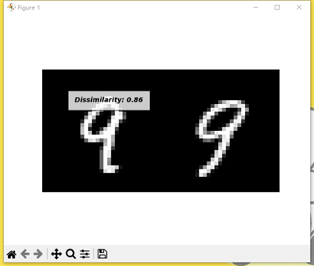

# PicsSimilarity
###### Calculate the similarity between two pics based on Siamese Neural Network
###### Including four component `Dataset.py`, `Model.py`, `Train.py` and `Test.py`.

To calculate the similarity between CIFAR or MNIST, I used Siamese Network to solve the problem. There is four sections to achieve the algorithm. The first section receive dataset and reshape it to be accepted by Siamese Network. The second part builds the Siamese Network used, the third part uses the previous content for training and finally the computed model is tested.

## Dataset.py
###### Datasets Standardization
The first part is placed in the file Dataset.py. The Datasets object accepts parameters about datasets(which dataset you want to transform), transform(the way which transform the dataset), should invert(if want the picture invert), train(train dataset or test dataset), mnist(true for MNIST dataset, false for CIFAR10 dataset), and randomly select the same kind or different kinds of images by getitem method. images of the same kind or different kinds randomly by the getitem method, combining them as a single piece of data and returning it.

## Model.py
###### Model Design
The second part of the model is placed in the file Model.py. Sianese network performs three times padding, convolution, activation and batch normalization on the images, then use linear get the vector data. In forward method, it will return the result of two figure. The other part of Model.py is Contrastive Loss class to calculate the loss.

## Train.py
###### Model Training
The third part of the model is placed in the file Train.py, which defines the data to be trained before the training of the for statement, selects the dataset to be used for training, defines the neural network to be used for training, and then records the history of the loss during the training, and shows the optimization of the loss in a graph.

|||
|:-:|:-:|
| CIFAR-10 Loss History | MNIST Loss History |

## Test.py
###### Model Testing
The final test is placed in the file Test.py, where the data in the test dataset is tested using the optimal model with the lowest recorded loss, and the euclidean distance which means their dissimilarity is calculated.
| CIFAR-10 dissimilarity test result |||
|:-:|:-:|:-:|
| MNIST dissimilarity test result|||

## Virtual Environment

| Name | Version |
| :--: | :-----: |
|`Python`| 3.11.9 |
|`Gym`| 0.22.0 |
|`Matplotlib`| 3.9.0 |
|`Pypiwin32`| 223|
|`Tensorboard`| 2.16.2 |
|`Torch`| 2.3.0 + cu121 |

# End